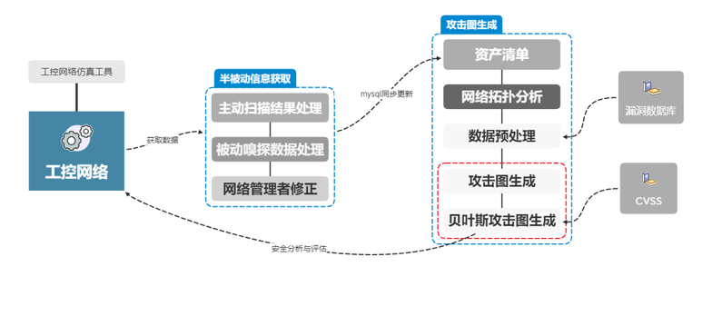
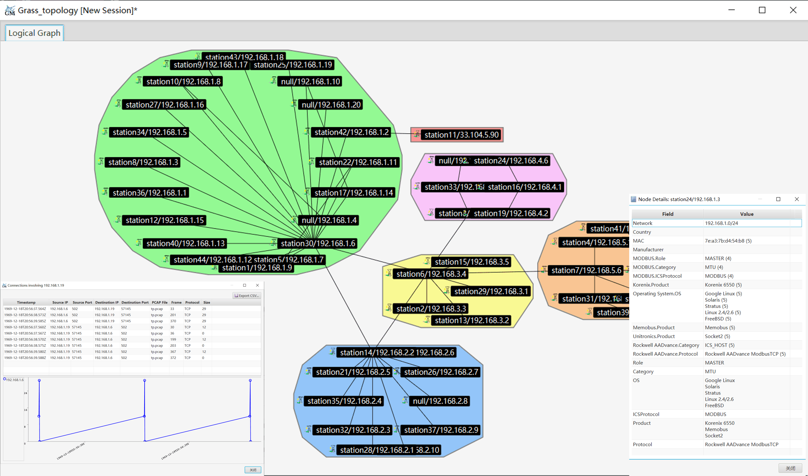
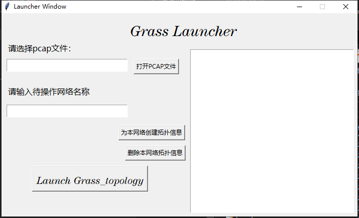
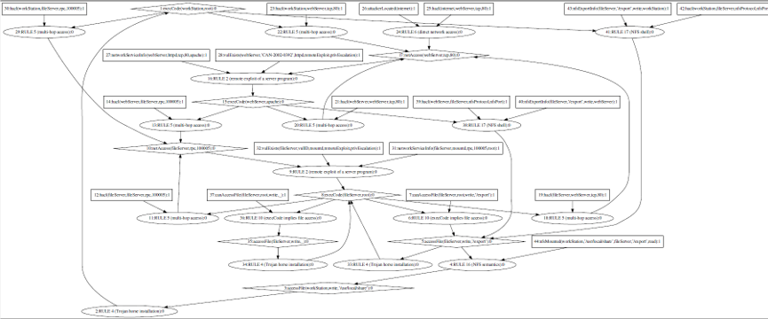
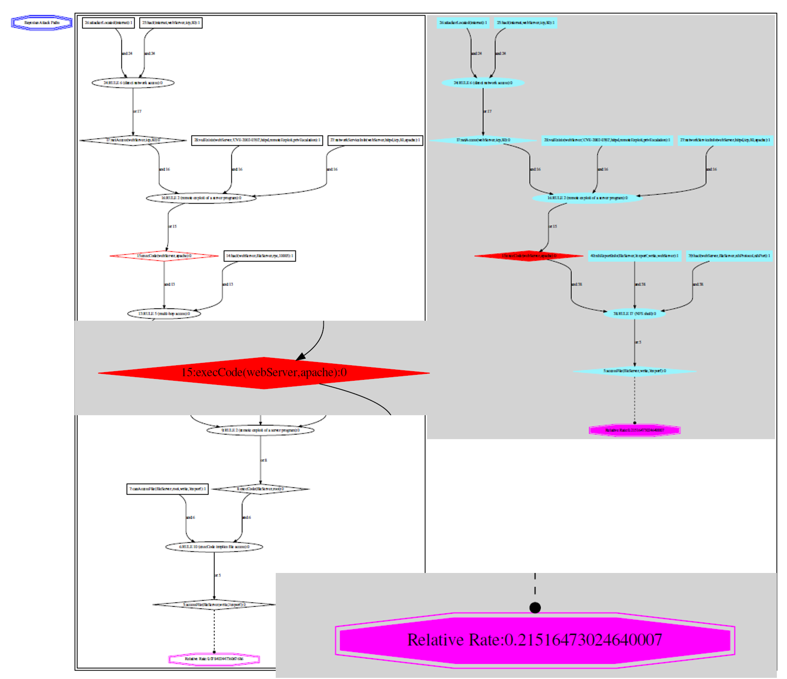
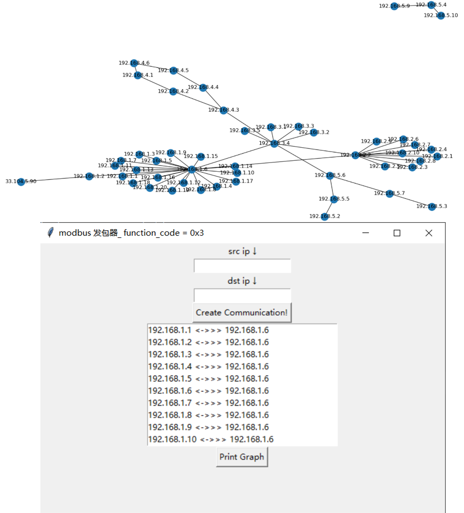

# Sicsp_ICS

In this project, we first proposed ```semi-passive information acquisition``` to obtain necessary network information considering the particularity of ICS network. Further, thanks to the relatively comprehensive network information obtained, attack graphs can be generated for network situational awareness.

Finally,  network administrators can use the network topology map, asset inventory table, and attack graph generated by this project to dynamically obtain network information in real time and complete risk quantification.

This repo can be easily used with the help of Django project [Sicsp](https://github.com/JianmingGuo/Sicsp-Web).




## Semi-passive Information Acquisition
The most important part is information acquisition. However, considering the particularity of the industrail control network, it's impossible to scan the 
target network like other networks. Thus, we proposed seme-passive information acquisition which integrates active scanning results(nessus etc) and real-time
network topology analysis results.

### GM3-compile

real-time network topology analysis module. The improvements is based on the [GrassMarlin](https://github.com/nsacyber/GRASSMARLIN). The specific improvements refers to storing network information
with an asses list and being well compatible with mysql. This project is the compiled version and can be launched by ```Grass_Launcher```



### Grass_Launcher

The project integrates database operation and the lancher of Grass



## AG/BAG Generation

The object of this project is the network situational awareness of industrial control network. The goal is implemented by Attack Graph(AG) and 
Bayesian Attack Graph(BAG). After obtaining the necessaty information, we first generate the attack graph based on the [mulval](https://people.cs.ksu.edu/~xou/argus/software/mulval/readme.html).
Further, we generate BAG based on the AG. The code is in the ```BAG```.





## Accessory module

### Simulation

Considering the difficult access to industrial control network message, we also developed a simulation module. The code is in ```Simulation```. With the help
of the wireshark, we can easily obtain the message.




### database

A required step is to obtain vulnerability information with the help of NVD/CNVD. So we also upload the code to obtain and analyse NVD/CNVD vulnerability information.

The structure be like

name | data 
:-: | :-: 
CNVDID | CNVD-2020-22318
CVEID | CVE-2020-6992
cvss2 | 高(AV:N/AC:L/Au:N/C:C/I:C/A:C)
cvss3 | CVSS:3.1/AV:L/AC:L/PR:H/UI:N/S:U/C:H/I:H/A:H
影响机型 | GE CIMPLICITY <=v10.0
漏洞简介 | GE CIMPLICITY是美国通用电气（GE）公司的一款基于客户端/服务器的HMI/SCADA解决方案…
漏洞补丁链接 | https://digitalsupport.ge.com
公开日期 | 2020-04-08
漏洞利用类型 | localExploit
漏洞利用结果 | privilege escalation


